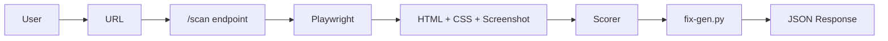
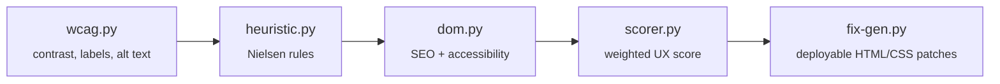

<div align="center">

# UXray

### An AI agent that browses live websites, scores them against real usability & accessibility heuristics, and ships deployable fixes — in conversation.


`PS-2` · `Ignite Room` · 

</div>

---

## Table of Contents

- [The Problem](#-the-problem)
- [What We're Building](#-what-were-building)
- [How It Works](#%EF%B8%8F-how-it-works)
- [Core Features](#-core-features)
- [Accessibility Standards (WCAG)](#-built-on-real-accessibility-standards)
- [Nielsen's Heuristics](#-grounded-in-nielsens-heuristics)
- [How We Score a Site](#-how-we-score-a-site)
- [Why We Beat the Alternatives](#-why-we-beat-the-alternatives)
- [Why This Stands Out](#-why-this-stands-out)
- [Tech Stack](#%EF%B8%8F-tech-stack)
- [Roadmap](#-roadmap)

---

## The Problem

> **UX audits today don't scale — and they miss what actually matters.**

| Expensive, slow, expert-dependent | Existing tools miss what matters |
|---|---|
| Manual UX audits need senior reviewers and days of effort — out of reach for most product teams. | Automated scanners catch technical bugs but stay blind to confusing flows, unclear copy, and frustrating journeys. |

<div align="center">

| 88% | 71% |
|:---:|:---:|
| of users **won't return** to a website after a bad UX experience | of sites **fail basic WCAG** accessibility checks, locking out millions of users |

</div>

---

## What We're Building

**An AI agent that audits, ranks, fixes, and explains — conversationally.**

```mermaid
flowchart LR
    A[Browses live websites] --> B[Scores against<br/>heuristics + WCAG]
    B --> C[Generates<br/>deployable fixes]
    C -.->|"Ask why / what it changes"| D[Conversational<br/>follow-up]
````

| Capability                           | What it does                                                                           |
| ------------------------------------ | -------------------------------------------------------------------------------------- |
| **Browses live websites**            | Agentic browser captures real user journeys — no manual screenshots                    |
| **Scores against heuristics + WCAG** | Combines UX heuristics with accessibility guideline validation                         |
| **Generates deployable fixes**       | Outputs ranked, ready-to-ship HTML/CSS patches — not just a report                     |
| **Conversational follow-up**         | Ask the audit assistant *why* an issue matters or *what* a fix changes — in plain chat |

---

## How It Works

> Python + FastAPI backend — async, multi-scan — powered by **Playwright** and **BeautifulSoup**

```mermaid
flowchart LR
    URL[URL Input<br/>User submits a site] --> BR[Agentic Browser<br/>Playwright crawls real pages,<br/>captures computed styles & screenshot]
    BR --> ENGINE[UX + WCAG Engine<br/>wcag.py → heuristic.py → dom.py → scorer.py → fix-gen.py]
    ENGINE --> SEV[Severity Ranking<br/>Critical / Medium / Low]
    SEV --> FIX[Fix Generator<br/>Deployable HTML/CSS patches → JSON]

    CHAT[Chat Q&A]
    BR -.-> CHAT
    ENGINE -.-> CHAT
    SEV -.-> CHAT
    FIX -.-> CHAT
```

**Chat Q&A sits alongside the whole pipeline** — at any stage, ask the assistant to explain a finding, justify a severity score, or walk through a suggested fix.

---

## Core Features

> Nine capabilities, built around one differentiator

| # | Feature                       | Description                                |
| - | ----------------------------- | ------------------------------------------ |
| 1 | Live website scan             | Agent browses the real site directly       |
| 2 | Severity ranking              | Critical, medium, or low on every issue    |
| 3 | Auto-generated fixes          | Deployable HTML/CSS patches                |
| 4 | Conversational follow-up      | Ask why an issue matters, in chat          |
| 5 | Export PDF report             | Shareable summary for stakeholders         |
| 6 | Before / after preview        | Fix rendered side by side with original    |
| 7 | **Persona-based UX** `UNIQUE` | Re-audits from different age/ability views |
| 8 | Mobile + desktop view         | Checks responsive behaviour                |
| 9 | UX scorecard                  | Visual design + accessibility, out of 100  |

---

## Built on Real Accessibility Standards

> WCAG's four principles drive our validation engine — not a generic linter.

<table>
<tr><td align="center"><b>Perceivable</b><br><sub>Color contrast ≥ 4.5:1</sub></td>
<td align="center"><b>Operable</b><br><sub>Full keyboard navigation</sub></td>
<td align="center"><b>Understandable</b><br><sub>Clear, labelled content</sub></td>
<td align="center"><b>Robust</b><br><sub>Screen-reader compatible</sub></td></tr>
</table>

<details>
<summary><b>Real checks our engine runs</b> (click to expand)</summary>

| Check                | Rule                                                                                                        |
| -------------------- | ----------------------------------------------------------------------------------------------------------- |
| **Contrast ratio**   | Normal text ≥ 4.5:1, large text ≥ 3:1 (black on white = 21:1). Ratio < 3.0 = **Critical**, < 4.5 = **High** |
| **Alt text**         | `` tags must carry a meaningful `alt` attribute                                                        |
| **Heading order**    | H1 → H2 → H3 maintained; `<title>` tag present                                                              |
| **Buttons & labels** | Buttons need a main text label; `<html lang>` set; `<meta name="description">` present                      |
| **Form fields**      | Every form field has a clear, visible label                                                                 |

</details>

---

## Grounded in Nielsen's Heuristics

> Jakob Nielsen — the godfather of UX — defined 10 rules experts use by instinct. We encode them.

<details open>
<summary><b>The heuristics our engine checks for</b></summary>

| Heuristic                 | Encoded as                                   |
| ------------------------- | -------------------------------------------- |
| Visibility of status      | Spinner on click, not a frozen button        |
| Error prevention          | Confirm before an accidental form submit     |
| User control & freedom    | Undo, back, and cancel always available      |
| Consistency & standards   | Login button always top-right                |
| Real-time error checks    | Flag invalid email before final submit       |
| Recognition over recall   | Icons paired with labels, never alone        |
| Flexibility & efficiency  | Search bar plus menu plus shortcuts          |
| Aesthetic, minimal design | No clutter competing for attention           |
| Help recognize & recover  | "Phone needs 10 digits", not "invalid input" |

</details>

---

## How We Score a Site

<div align="center">

### Final UX Score = WCAG (40%) + Heuristic (35%) + DOM (25%)

</div>

|  Weight | Component       | What it measures                                                                                                                                                |
| :-----: | --------------- | --------------------------------------------------------------------------------------------------------------------------------------------------------------- |
| **40%** | WCAG score      | Contrast, alt text, headings, labels. Critical issues: −30 pts max · High: −25 pts max · Medium: −15 pts max                                                    |
| **35%** | Heuristic score | Nielsen's 10 rules scored live: `nav` element +10 · missing skip-to-main −5 · no logo/home link −3 · icon buttons without labels −8 · no footer −3              |
| **25%** | DOM score       | Starts at 100. Deductions: missing `H1` −8 · missing `<html lang>` −12 · missing `<meta description>` −10 · missing semantic `nav` −10. *(SEO + Accessibility)* |

---

## Why We Beat the Alternatives

> Existing options solve one slice of the problem — we cover the full loop.

| Capability                  | **Us** | Lighthouse / axe | Manual Audit | Survey Tools |
| --------------------------- | :----: | :--------------: | :----------: | :----------: |
| Finds real usability issues |    ✅   |         ❌        |       ✅      |      ⚠️      |
| WCAG accessibility checks   |    ✅   |         ✅        |       ✅      |       ❌      |
| Generates deployable fixes  |    ✅   |         ❌        |       ❌      |       ❌      |
| Conversational follow-up    |    ✅   |         ❌        |       ❌      |       ❌      |
| Fast and low cost           |    ✅   |         ✅        |       ❌      |      ⚠️      |

*Lighthouse/axe catch technical bugs only. Manual audits are accurate but slow and costly. Survey tools collect opinions, not fixes.*

---

## Why This Stands Out

> Most auditors stop at technical bugs. We go further.

|                              |                                                                  |
| ---------------------------- | ---------------------------------------------------------------- |
| **Fixes, not just findings** | We ship deployable code, not a 40-page PDF nobody reads          |
| **Persona-based re-audits**  | The same site judged from different age and ability perspectives |
| **It talks back**            | Conversational follow-up turns the audit into a dialogue         |

---

## Tech Stack

<div align="center">


</div>

### Layers

| Layer                 | Stack                                                              | Role                                                                                                                                                                       |
| --------------------- | ------------------------------------------------------------------ | -------------------------------------------------------------------------------------------------------------------------------------------------------------------------- |
| **Backend**           | Python + FastAPI                                                   | Async — handles multiple scans simultaneously. Endpoints: `/scan` → URL result, `/chat` → conversational Q&A. Frontend-compatible: React / Vue / Angular via JSON response |
| **Browser layer**     | Playwright + BeautifulSoup                                         | Real headless browser, visits live JS-rendered pages, captures computed CSS + screenshot. BeautifulSoup parses DOM structure for analysis                                  |
| **Analysis pipeline** | `wcag.py` → `heuristic.py` → `dom.py` → `scorer.py` → `fix-gen.py` | Contrast/labels/alt text → Nielsen rules → SEO + accessibility → weighted UX score → template-based deployable HTML/CSS patches                                            |

### Request Flow



### Pipeline Files



---


<div align="center">

### Built for `PS-2 · Ignite Room` 

*An audit that doesn't just find problems — it fixes them and talks you through why.*

</div>
